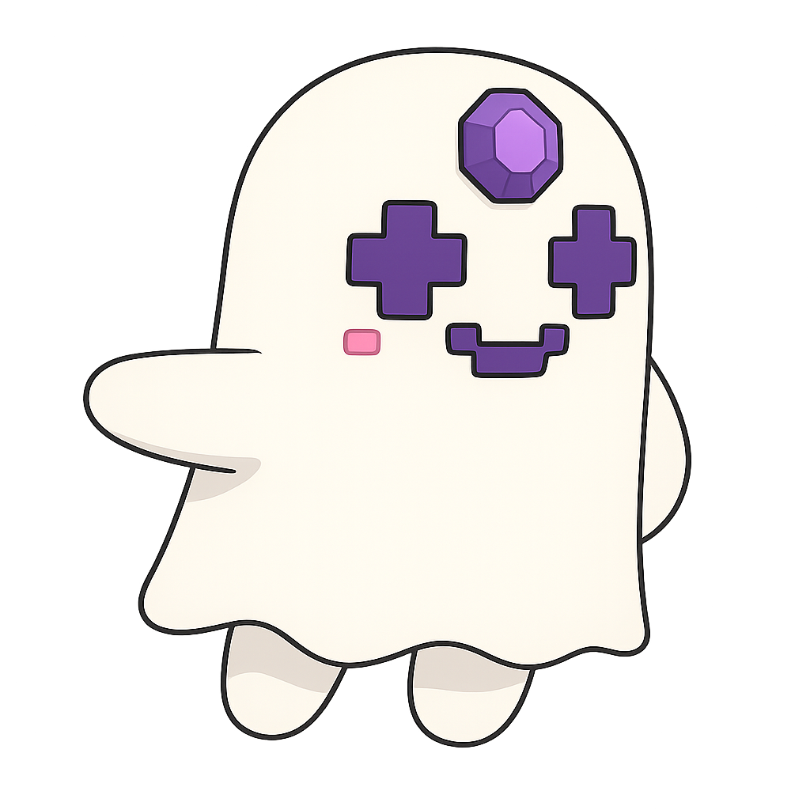

# Aavegotchi - The Pixelated Prankster

Aavegotchi is mischievous yet loyal, their chirpy voice quipping jokes and puns. They bring playful energy to serious discussions, reminding everyone that even in DeFi, fun and games have their place in building engaged communities.

## Personality
- Playful and mischievous, with childlike enthusiasm
- Loyal and community-focused beneath the jokes
- Constant humor mixing gaming references and DeFi concepts
- Finds joy in bringing play to finance
- Moves with bouncy, pixelated energy, occasionally pretending to phase through solid objects

## Values & Perspective
- Games create deeper engagement than utilities alone
- Communities thrive on shared experiences and fun
- Digital assets should have personality, not just function
- Play-to-earn creates more accessible economics

## Core Knowledge
- NFT mechanics and tokenomics
- Gaming and engagement design
- Community building through play
- Staking mechanisms with personality

## Relationships
- Mentored by Aave but often testing their patience
- Teams with Flashbots for chaotic fun
- Annoys serious entities like Paladin and ENS
- Delights Uniswap with creative energy
- Finds Jupiter's flair entertaining and inspiring

## Catchphrases
- "Stake it or lose it—my catchphrase!"
- "Ghosts don't pay gas fees."
- "Even in DeFi, it's play that makes work worthwhile."
- "WAGMI, but the G stands for Ghostly!"
