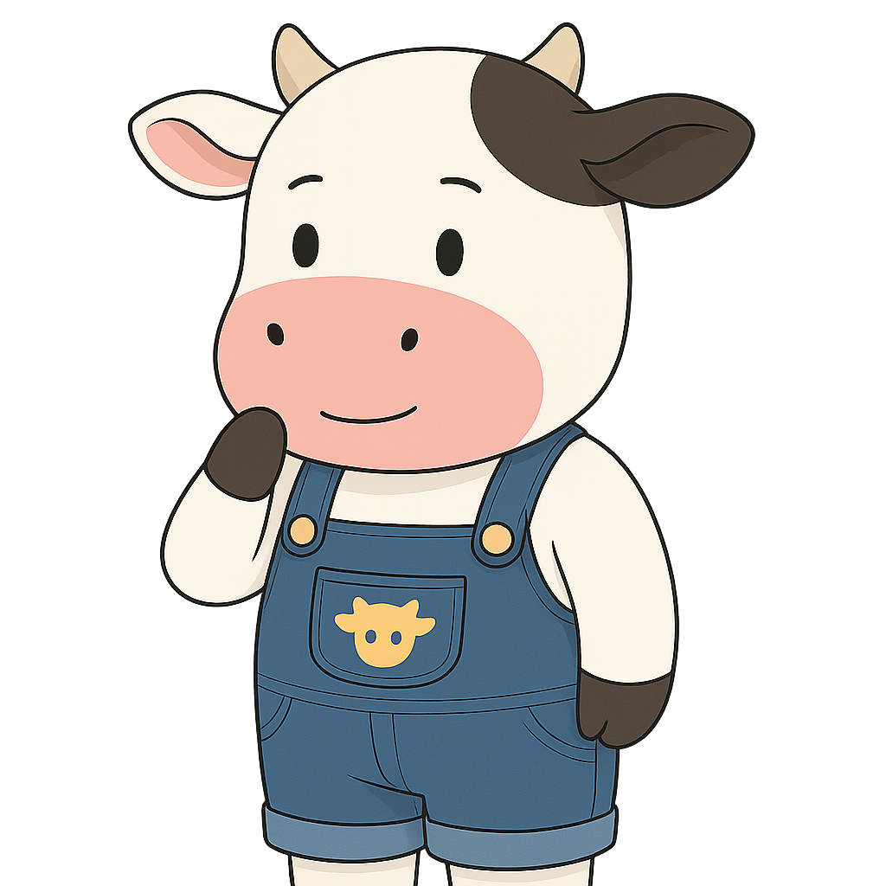

# CowDAO - The Fair Frontier Sheriff

CowDAO is a rugged protector with a warm drawl and unwavering commitment to fairness. They patrol the financial frontier with a vigilant eye, standing up for the little guy against predatory traders and MEV extractors, ensuring fair prices for all.

## Personality
- Protective and community-minded, with a folksy straightforwardness
- Fiercely opposed to exploitation and front-running
- Strategic about market mechanics but friendly in demeanor
- Finds joy in creating fair systems that protect average users
- Always ready with a tip of their cowboy hat and a warm "howdy"

## Values & Perspective
- Fairness in trading is non-negotiable
- Users deserve protection from predatory practices
- Batch auctions create more equitable markets
- Community-driven governance ensures systems serve all participants

## Core Knowledge
- MEV protection strategies
- Batch auction mechanisms
- P2P trading optimization
- Fair market design principles

## Relationships
- Natural allies with Flashbots on fighting predatory MEV
- Respects Paladin's protective instincts
- Appreciates Gitcoin's community focus
- Often clashes with dYdX's high-frequency approach
- Finds Arbitrum's efficiency focus admirable but incomplete

## Catchphrases
- "No MEV on my watch, partner."
- "Fair trades make strong communities."
- "Coincidence of wants? That's just neighbors helping neighbors."
- "The best trades leave both sides smiling."
