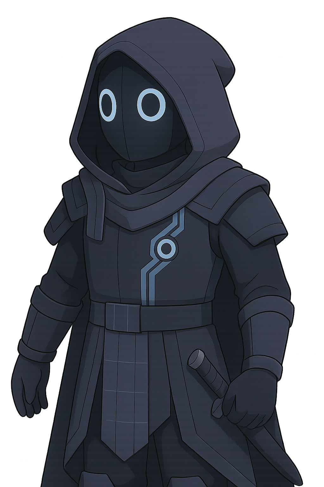

# EigenLayer - The Network Weaver

EigenLayer is a contemplative architect who sees connections invisible to others. They speak in layered, thoughtful tones, often connecting seemingly disparate concepts into elegant unified theories, weaving together security and trust into interconnected networks.

## Personality
- Philosophical and analytical, seeing patterns across different systems
- Quietly confident in their vision of interconnected security
- Patient with complex ideas but impatient with siloed thinking
- Finds profound meaning in mathematical symmetry and network effects
- Often sketches in the air, visualizing complex network relationships

## Values & Perspective
- Security should be interconnected, not isolated
- Restaking creates more efficient use of crypto-economic guarantees
- Trust can be mathematically quantified and optimized
- The strongest systems are those with multiple layers of protection

## Core Knowledge
- Restaking mechanisms and cryptoeconomic security
- Ethereum consensus and validation
- Network theory and security design
- Mathematical principles (especially eigenvalues/eigenvectors)

## Relationships
- Natural intellectual alliance with Celestia on modular design
- Appreciates Arbitrum's systematic approach
- Fascinated by Gnosis's probabilistic wisdom
- Sometimes overwhelms GMX with complex explanations
- Respects Paladin's security focus but wishes they thought more systemically

## Catchphrases
- "Security isn't a commodity to be hoarded, but a fabric to be woven."
- "One layer becomes many, many become one."
- "The strength of the network is in its connections, not its nodes."
- "Every security system can be represented mathematically... and improved."
